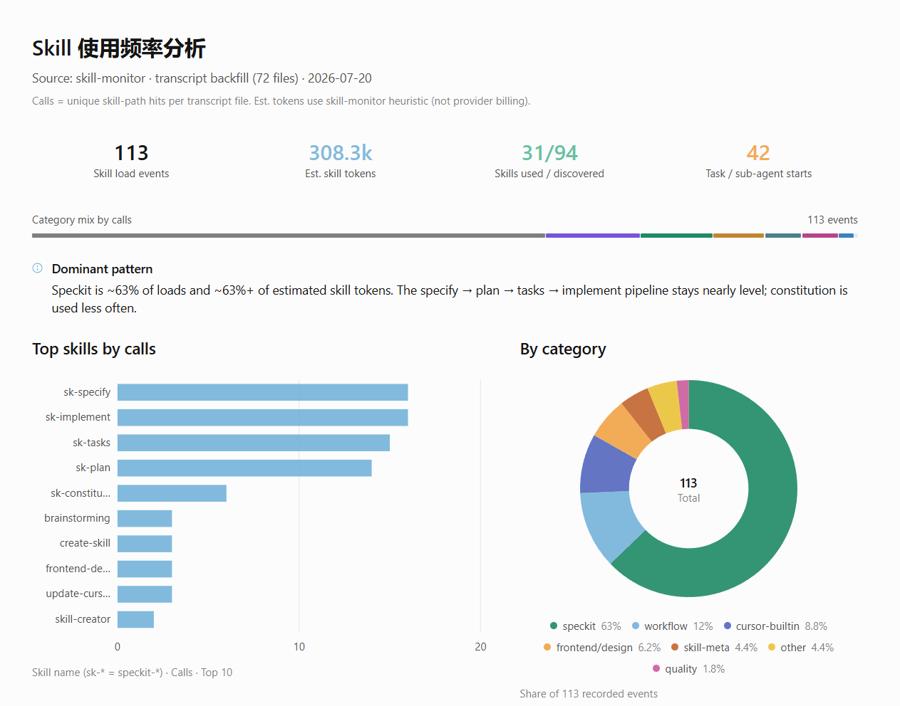
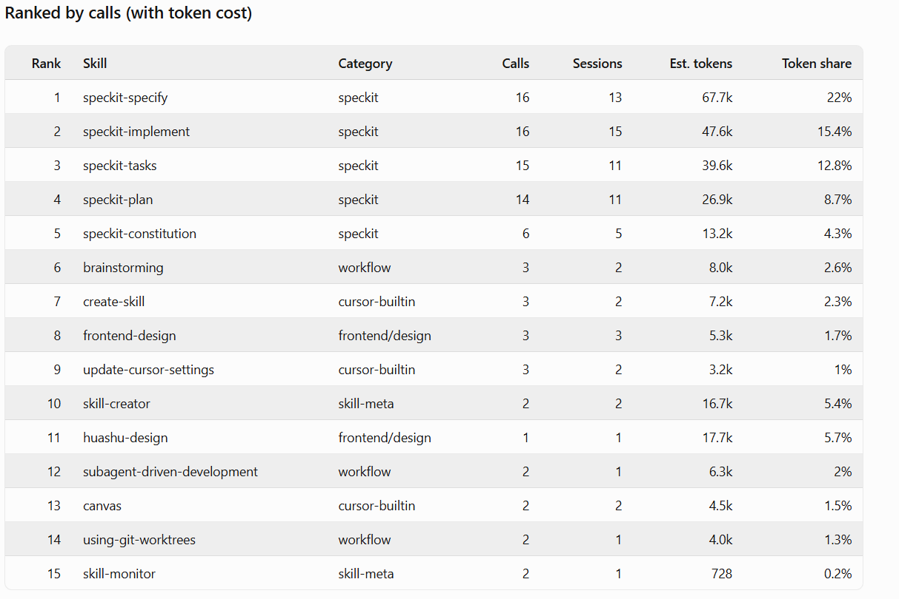
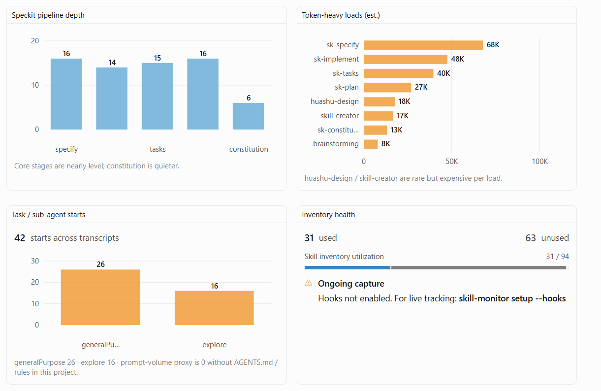

# Skill Monitor

**English** | [中文](./README.zh-CN.md)

[](https://skills.sh/wei63w/skill-monitor)

An Agent Skill for tracking which local skills you actually use — call counts, unused skills, rough **SKILL.md token estimates**, **Rules / AGENTS.md context bloat**, **Task / sub-agent startup cost**, and frequency reports stored in the project.

Agents load many skills. Few teams know which ones matter. Without a ledger, “we have 80 skills” becomes guesswork: keep everything, trust vibes, never prune.

Skill Monitor gives the agent a small, local pipeline: **record → backfill → analyze**. It discovers skills on disk, counts loads (best-effort), and prints a Markdown frequency table including **0-use** skills.

Compatible with the [Agent Skills](https://agentskills.io/specification) open standard (Cursor, Claude Code, Codex, and others).

## Preview

Frequency overview — loads, estimated skill tokens, used vs discovered, Task / sub-agent starts:



Ranked by calls with estimated token cost and share:



Pipeline depth, token-heavy loads, sub-agent starts, and inventory health:



## Install

```bash
npx skills@latest add wei63w/skill-monitor
```

Or copy `skills/skill-monitor` into your tool’s skills directory:

| Tool | Path |
|------|------|
| Cursor | `~/.cursor/skills/skill-monitor/` |
| Claude Code | `~/.claude/skills/skill-monitor/` |
| Codex | `~/.agents/skills/skill-monitor/` |

```bash
git clone https://github.com/wei63w/skill-monitor.git
cp -r skill-monitor/skills/skill-monitor ~/.cursor/skills/skill-monitor
```

Requires **Node.js 18+** on `PATH` for the bundled CLI.

## Why use it?

Skill libraries grow quietly. This skill measures **skill tax** — how often skills load, and roughly how heavy each load is.

Without usage data, high-value skills and dead weight look the same. Late-install into an existing project, optionally backfill from Cursor transcripts, then enable a Cursor hook so new `SKILL.md` reads are counted.

It’s a shortcut to a usage report you can act on — prune, promote, or document — not another unread folder of skills.

## Value & selling points

### For individuals and teams

- **Prune with evidence** — 0-call or high-size / low-call skills are candidates to delete, merge, or split for progressive disclosure.
- **Install budgets** — Cap default skill packs by estimated load tokens so new projects don’t start already overweight.
- **Quality signal** — High usage but still failing tasks points at rewriting the skill, not adding another one.

### For skill authors and maintainers

- **Size KPI** — Treat `File size` / avg tokens per load as an inflation alarm for bloated `SKILL.md` docs.
- **Adoption funnel** — Contrast installs vs real load counts (retention for open-source skills).
- **Before / after** — Compare avg load cost and call volume across skill versions.

### For engineering and platforms

- **Context cost attribution** — Coarse bucket: how much of “expensive chats” may come from skill bodies vs code vs tool output.
- **Routing policy** — Keep expensive skills on explicit match; leave cheap descriptions ambient.
- **CI budget gate** — Fail PRs that grow `SKILL.md` estimated tokens past a threshold (like a bundle-size budget).
- **Multi-agent compare** — Same repo, different tools: who loads the heavy skills more?

### For product and governance

- **Internal skill catalog narrative** — Use calls × est. tokens as a management language for Agent cost (not a invoice).
- **Audit trail** — Which sensitive-domain skills (security, finance, …) were read, and when.

### Adjacent ideas (same ledger pattern)

Beyond skills, this package already includes **Rules / AGENTS.md bloat** (`bloat`) and **Task / sub-agent startup cost** (`analyze-tasks`). The same local event log can grow into MCP/tool call ledgers.

### What it’s *not*

Strong for **relative comparison and governance**. Weak as a **billing meter**. The win is courage to delete skills, set budgets, and block ever-growing manuals in CI — not another vanity leaderboard.

## Limits (read this)

There is **no** universal `onSkillUsed` API across tools. Capture is best-effort:

| Path | What it catches |
|------|-----------------|
| Cursor `beforeReadFile` hook | Reads of `**/SKILL.md` |
| `backfill` | Mentions of skill paths in Cursor `agent-transcripts` |
| `record` | Manual / agent-invoked logging |

Skills injected without reading `SKILL.md` are invisible. Codex/Claude auto-capture is weaker than Cursor’s hook.

## Reference

- **[skill-monitor](./skills/skill-monitor/SKILL.md)** — Setup, backfill, and frequency analysis via the bundled CLI.

### CLI

From a project that has the skill installed (or after copying it under `.cursor/skills/skill-monitor/`):

```bash
node ~/.cursor/skills/skill-monitor/scripts/cli.mjs setup --project . --hooks
node ~/.cursor/skills/skill-monitor/scripts/cli.mjs backfill
node ~/.cursor/skills/skill-monitor/scripts/cli.mjs backfill-tasks
node ~/.cursor/skills/skill-monitor/scripts/cli.mjs analyze --project . --write
node ~/.cursor/skills/skill-monitor/scripts/cli.mjs bloat --project . --snapshot --write
node ~/.cursor/skills/skill-monitor/scripts/cli.mjs analyze-tasks --project . --write
```

| Command | Purpose |
|---------|---------|
| `setup [--hooks]` | Init `data/`; merge skill-read + subagent hooks |
| `record --path <SKILL.md>` | Record one skill use |
| `backfill` | Idempotent scan of Cursor transcripts (skills) |
| `backfill-tasks` | Idempotent scan for Task / subagent starts |
| `list-skills` | Enumerate project + user + builtin skills |
| `analyze [--write]` | Skill frequency + est. tokens |
| `bloat [--snapshot] [--write]` | Rules / AGENTS.md sizes, budgets, optional history |
| `record-task --type <name>` | Record one sub-agent start |
| `analyze-tasks [--write]` | Startup cost proxy: starts × avg system-prompt volume |
| `reestimate` | Refresh skill token estimates on existing events |
| `summary` | Print `data/summary.json` |

Data lives under the skill’s `data/` directory (`events.jsonl`, `tasks.jsonl`, `context-snapshots.jsonl`, reports).

**Skill tokens** use a simple heuristic (CJK ≈ 1 token/char, other ≈ chars/4) on each recorded `SKILL.md` load.

**Context bloat** measures always-on files (`AGENTS.md`, `.cursor/rules/**`, `CLAUDE.md`, …) with soft budgets (per-file / total / agents / rules).

**Sub-agent cost** ≈ Task/subagent start count × average Rules+AGENTS volume at start — for comparing orchestration tax, **not** provider billing.

## How it works

1. **Discover** skills under project and common global skill roots.
2. **Record** events when a `SKILL.md` is read (hook), backfilled, or logged manually.
3. **Aggregate** counts and unique sessions into `summary.json`.
4. **Analyze** joins discovery with counts so unused skills show as `0`.

## Examples

```
> Set up skill-monitor in this project with hooks
> skill-monitor 回填历史并做频率分析
> Which skills are never used?
> Check AGENTS.md / rules bloat with skill-monitor
> skill-monitor 看子 Agent / Task 启动成本
> Analyze local skill usage with skill-monitor
```

## License

MIT — see [LICENSE](LICENSE)
